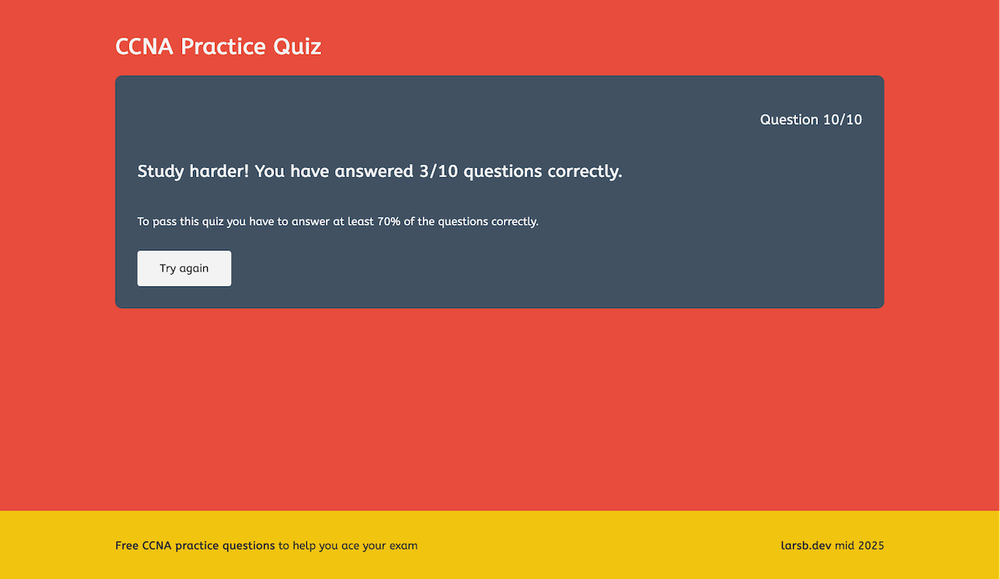

# CCNA Practice Quiz Web App

## About

This project features a full-stack [Cisco Certified Network Associate (CCNA)](https://www.cisco.com/site/us/en/learn/training-certifications/certifications/enterprise/ccna/index.html) practice quiz web application where a backend API endpoint returns a list of practice questions that the frontend fetches and renders dynamically in the browser.


## Motivation

Up until this point I've coded in a very isolated way and haven't really experienced how all the pieces of an application fit together. With this project I wanted to learn how the frontend talks to the backend by fetching data from one of my API endpoints. I've decided to develop an idea that has a manageable scope, because starting small prevents overwhelm and makes for a solid weekend project.

To top it off, I've used Docker Compose and a DigitalOcean Linux droplet to deploy this app to the cloud. 

The site is currently live and can be tested at https://ccna-practice-quiz.larsb.dev.

## Development Flow

### 1. Backend API (FastAPI)

- Setting up endpoint(s) to fetch practice questions
- Modeling a `Question` class
- Creating a question bank of `Question` objects
- Adding validation and exception handling
- Returning correct HTTP status codes
- Testing with Swagger and Insomnia

Note: In a future project I will use a database for data persistence.

### 2. Frontend (HTML, CSS and Vanilla JS)

- Designing the UX flow (next question, result screen, reload)
- Building a frontend with HTML and CSS
- Manipulating the DOM (show/hide elements, updating text, event listeners)
- Implementing the `fetch()` API to fetch questions from the backend

### 3. Full-stack thinking

- Separation of concerns (backend = data, frontend = presentation)
- Data exchange via JSON

### 4. Deployment

- Writing a Dockerfile for the backend
- Crafting a Docker Compose file
- Learning about Caddy and reverse proxies to fix CORS (same origin for both frontend and backend)
- Setting up Linux droplet on DigitalOcean
- Securing the droplet according to best practices
- Deploying the app with GitHub fine-grained access token

## Implementation Details

### Backend

Instead of storing plain dictionaries, I modeled a `Question` class and maintained a list of `Question` objects. This makes the data structure more robust and easier to work with. In the future, if I want to support `POST`, `PUT`, or `DELETE` operations, I can define a Pydantic model (e.g., `QuestionRequest` inheriting from `BaseModel`) to validate incoming request payloads. The validated data can then be converted into `Question` objects, ensuring a consistent and type-safe workflow between the API layer and the application logic.

```python
@dataclass
class Question:
    id: int
    text: str
    options: list[str]
    answer: str
    
questions = [
    Question(id=0, text="Which OSI layer handles logical addressing and routing?", options=["Data Link", "Network", "Transport", "Session"], answer="Network"),
]
```

### Frontend

An event listener on each of the answer option buttons listens for click events. Whenever a user presses one of the buttons, the pressed button object is passed as an argument to the `checkAnswer()` function. 

```javascript
options.forEach(option => {
  option.addEventListener('click', () => {
    checkAnswer(option);
  });
});
```

The `checkAnswer()` function checks if the selected answer is equal to the current question's actual answer. If it is, the user's score is incremented by one. After that, the index of the current question is incremented by one and it is checked, if the current index is less than the questions array's length. If it is, the app loads a new question and if not, the quiz is over and a results screen is shown.

```javascript
  if (selectedAnswer === currentQuestion.answer) {
    score++;
  }

  currentIndex++;

  if (currentIndex < questions.length) {
    loadQuestion();
  } else {
    options.forEach(option => {
      option.style.display = 'none';
    })
    info.style.display = 'block';
    reload.style.display = 'inline-block';
    if (score / questions.length >= 0.7) {
      document.querySelector('body').style.backgroundColor = '#27ae60';
      question.textContent = `Congratulations 🎉 You have answered ${score}/${questions.length} questions correctly.`;
    } else {
      document.querySelector('body').style.backgroundColor = '#e74c3c';
      question.textContent = `Study harder! You have answered ${score}/${questions.length} questions correctly.`;
    }
  }
```




### Deployment

The backend Docker container is built using the Dockerfile that is stored in the backend directory. Caddy is used as the frontend server that serves static files and acts as a reverse proxy. The bind mount volume `./frontend:/usr/share/caddy` mounts the static frontend files and `./conf:/etc/caddy` stores the `Caddyfile` that contains the configurations for the Caddy server. 

```yml
version: "3.9"

services:
  backend:
    build: ./backend
    container_name: ccna-backend

  caddy:
    image: caddy:2
    container_name: ccna-caddy
    ports:
      - "80:80"
      - "443:443"
    volumes:
      - ./frontend:/usr/share/caddy
      - ./conf:/etc/caddy
      - caddy_data:/data
      - caddy_config:/config
    depends_on:
      - backend

volumes:
  caddy_data:
  caddy_config:
```

The first line of the `Caddyfile` sets the root for all requests to `/usr/share/caddy` where all the static files live. Whenever a request for `/questions` comes in, Caddy proxies that request to the backend. Thanks to Docker networking and its built-in DNS service, it's possible to simply specify the name of the backend Docker container and the port it is listening on. 

```
ccna-practice-quiz.larsb.dev {
    root * /usr/share/caddy
    file_server
    reverse_proxy /questions backend:8000
}
```

## Learnings

This project was definitely a challenge for me, but since it was just slightly above my comfort zone I was able to push through, finish it, and grow a lot in the process. The hardest part turned out to be deployment, since I had never done that before. I had played around with a Docker course in the past, but building this project gave me a real understanding of how Docker Compose works, how it ties in with a Dockerfile, and how useful bind mounts can be.

I'd like to thank my friend [@jl54](https://github.com/jl54) for suggesting that I try out the Caddy web server. It was a game changer since it automagically takes care of SSL/TLS certificates.

## Resources

- [How to Setup and Secure a Droplet on DigitalOcean](https://solomou.dev/blog/2023-11-05-how-to-setup-and-secure-a-droplet-on-digitalocean)
- [Caddy Image Docker Hub](https://hub.docker.com/_/caddy)
- [Caddy Docs](https://caddyserver.com/docs/)